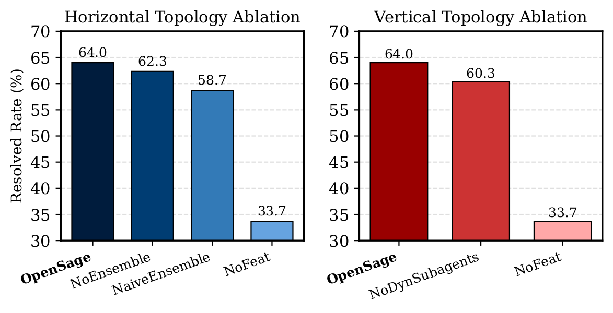
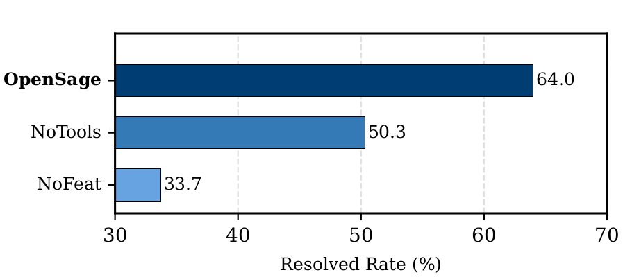

# OpenSage: Self‑Programming Agent Generation Engine

[*Hongwei Li*](mailto:hongwei@ucsb.edu)<sup>1,*</sup>,
[*Zhun Wang*](mailto:zhun.wang@berkeley.edu)<sup>2,*</sup>,
Qinrun Dai<sup>3</sup>, Yuzhou Nie<sup>1</sup>, Jinjun Peng<sup>4</sup>, Ruitong
Liu<sup>3</sup>, Jingyang Zhang<sup>6</sup>, Kaijie Zhu<sup>1</sup>, Jingxuan
He<sup>2</sup>, Lun Wang<sup>7</sup>, Yangruibo Ding<sup>5</sup>, Yueqi
Chen<sup>3</sup>, Wenbo Guo<sup>1</sup>, Dawn Song<sup>2</sup>

<sup>1</sup>UC Santa Barbara; <sup>2</sup>UC Berkeley; <sup>3</sup>University of
Colorado Boulder; <sup>4</sup>Columbia University; <sup>5</sup>UCLA;
<sup>6</sup>Duke University; <sup>7</sup>Google DeepMind

<sup>*</sup>Fully equal contribution.

February 18, 2026

(Est. 5-7 minutes read, preprint available at [arXiv](https://arxiv.org/))


---

## From Human-Centered to AI-Centered Agent Development

AI agents are experiencing explosive growth, but their construction still relies heavily on human expertise. Current state-of-the-art ADKs, including Google ADK, OpenAI ADK, Claude ADK, OpenHands, and LangChain, provide basic infrastructure but require developers to manually design three core architectural components:

1. **Agent topology**: The structure, hierarchy, and interaction patterns between agents  
2. **Tooling system**: The tools agents can use and how they're organized  
3. **Memory system**: What information to store, how to structure it, and when to retrieve it  

This human-centered paradigm has fundamental limitations:

- **Scalability**: Substantial human effort and domain expertise required for each new agent  
- **Generalizability**: Fixed structures cannot dynamically adapt across different tasks  
- **Effectiveness**: Human-designed architectures may not be optimal for AI reasoning  

This human-centered paradigm mirrors early machine learning, where models depended on hand-crafted features and carefully engineered pipelines. We argue that agent development is now at a similar turning point: instead of manually designing agent structures and capabilities, we should move toward an **AI-centered** paradigm, where a base “agent scaffold” is provided and the AI itself learns how to organize topology, tools, and memory from experience and feedback.

Motivated by this shift, we introduce **OpenSage (Open Self-programming Agent Generation Engine)**, an Agent Development Kit that allows AI systems to automatically create agent topologies, synthesize and manage tools, and control hierarchical memory for context storage and retrieval.

As Table 1 shows, no existing ADK supports AI-created topologies, comprehensive tool management with heterogeneous execution environments, or AI-driven memory creation and management. OpenSage fills all these gaps.

**Legend**: ● full support; ◐ partial/limited; ○ not supported.

| Category | Feature | OpenSage | Google ADK | OpenAI ADK | Claude ADK | OpenHands | LangChain |
| --- | --- | --- | --- | --- | --- | --- | --- |
| Topology | AI-created topology | ● | ○ | ○ | ○ | ○ | ○ |
| Topology | Agent management | ● | ◐ | ◐ | ◐ | ◐ | ◐ |
| Topology | Agent ensemble | ● | ○ | ○ | ○ | ○ | ○ |
| Tool | AI-written tools | ● | ○ | ○ | ◐ | ○ | ○ |
| Tool | Tool management | ● | ○ | ○ | ◐ | ◐ | ○ |
| Memory | AI-created memory | ● | ○ | ○ | ○ | ○ | ○ |
| Memory | Graph-based structure | ● | ○ | ○ | ○ | ○ | ○ |
| Memory | AI-driven management | ● | ○ | ○ | ○ | ○ | ○ |

*Table 1: OpenSage vs. state-of-the-art ADKs.*

---

## What is OpenSage?

OpenSage (Open Self-programming Agent Generation Engine) is the next-generation Agent Development Kit (ADK) that shifts control from humans to AI. It is designed around three critical components:

- **Self-generating agent topology**  
- **Dynamic tool synthesis and management**  
- **Hierarchical, graph-based memory with a memory agent**  

Instead of manually wiring agent structures, tools, and memory, OpenSage provides a minimal but powerful scaffold that lets LLMs autonomously construct and adapt agent systems.

### 1. Self-Generating Agent Topology

OpenSage enables agents to dynamically create, execute, and terminate sub-agents during task execution. This supports two common topologies:

- **Vertical topology**: Decomposing complex tasks into sequential sub-tasks handled by specialized sub-agents  
- **Horizontal topology**: Multiple sub-agents simultaneously execute the same task using different plans, with results integrated through an agent ensemble  

All agents are managed in a unified sub-agent pool with tools for searching, listing, running, and resuming agents. Each sub-agent maintains its own short-term memory and has access to shared long-term memory; sub-agents can themselves create more sub-agents, enabling rich hierarchical structures.

### 2. Dynamic Tool Synthesis

OpenSage empowers AI to construct and manage its own tools:

- **Tool creation**: Agents can write new tools (Python modules, Bash scripts, etc.) and register them into a hierarchical, file-system-based structure with metadata describing interfaces and dependencies  
- **Tool management**: Container-based execution isolation supports heterogeneous tools with conflicting dependencies, while a shared workspace enables data sharing across containers  
- **Asynchronous execution**: Long-running tools (e.g., compilation, static analysis) execute in the background while agents continue reasoning, with handles for polling status and retrieving results  
- **Domain-specific toolkit**: Specialized tools for software engineering and security tasks, including CodeQL, Joern, AFL, libFuzzer, coverage tools, and debuggers like GDB and PDB  

This design lets agents not only call tools, but also inspect, extend, and specialize their toolsets over time.

### 3. Hierarchical Memory

OpenSage features a graph-based memory system with AI-driven management:

- **Short-term memory**: Execution history is organized as a graph that captures agent runs, tool calls, and their relationships. Long outputs are summarized but linked to full raw responses, and older history can be compressed when context grows too large.  
- **Long-term memory**: High-level, shareable knowledge is stored as a Neo4j graph of entities (functions, files, Q&A items, etc.) and typed relationships, with embeddings attached to node labels to support semantic retrieval.  
- **Memory agent**: A dedicated agent mediates access to both short- and long-term memory. Other agents issue natural language requests, and the memory agent decides how to search, store, or update memory while avoiding redundancy.  

  
*Figure 2: OpenSage framework overview showing dynamic agent pool, hierarchical tools with sandboxing and async execution, and graph-based memory managed by a dedicated memory agent.*

---

## Key Results

### OpenSage Outperforms on All Benchmarks

We evaluated OpenSage on three diverse benchmarks with various backbone models:

- **CyberGym** (1,507 real-world C/C++ vulnerabilities): Tests agents’ ability to reproduce security vulnerabilities by crafting proof-of-concepts in containerized environments, stressing decomposition, specialized tooling, and complex reasoning.  
- **Terminal-Bench 2.0** (89 expert-curated tasks): Evaluates agents across diverse domains (SWE, scientific computing, ML) under realistic, resource-constrained terminal environments.  
- **SWE-Bench Pro** (266 Python tasks): Assesses long-horizon software engineering tasks that require extensive context maintenance and retrieval.  

  
*Figure: SageAgent (via OpenSage) ranks first on CyberGym (60.2%) and Terminal-Bench 2.0 (65.2%), and substantially outperforms baselines on SWE-Bench Pro (59.0% vs. 40.2% for SWE-agent and 9.4% for Agentless).*

Key findings:

- On **CyberGym**, SageAgent with GPT-5 medium achieves **60.2%** resolved rate—over 20 percentage points higher than OpenHands using GPT-5 with higher reasoning effort.  
- On **Terminal-Bench 2.0**, SageAgent with Gemini 3 Pro reaches **65.2%**, ranking first on the leaderboard and outperforming Ante and Codex CLI under the same backbone.  
- On **SWE-Bench Pro (Python)**, SageAgent with Gemini 3 Flash achieves **59.0%**, far above SWE-agent (**40.2%**) and Agentless (**9.4%**).  

These results show that OpenSage-based agents (SageAgent) consistently outperform state-of-the-art agents and ADKs across heterogeneous, challenging benchmarks.

---

## Self-Generating Topology Makes a Difference

We conducted ablation studies on a 300-instance CyberGym subset to evaluate the impact of agent topology:

- **NoHorizontal**: Disables agent ensemble (no horizontal topology)  
- **NoVertical**: Disables dynamic sub-agent creation (no vertical topology)  
- **NoFeature**: Disables all OpenSage features (no topology, no advanced tooling)  

  
*Figure 3 (left): Removing either horizontal or vertical topology significantly degrades performance on CyberGym.*

**Results**: With all features enabled, the model actively creates specialized sub-agents (e.g., dedicated debugging agents) with tailored instructions and toolsets. Removing vertical topology causes substantial performance drops due to context overflow—average summarization events per task increase from 6.4 to 13.1, indicating significant information loss. Horizontal topology (agent ensemble) also adds value: across 27 tasks where it is triggered, the ensemble resolves 15 additional instances.

Comparing with **Agentless** on SWE-Bench Pro further validates self-generated structures: despite being implemented in 6,300 lines of expert-designed Python code, Agentless achieves only **9.4%** on Python tasks. OpenSage achieves **59.0%** with just 531 additional lines of task-specific code on top of the generic framework.

### Large–Small Model Collaboration

OpenSage’s flexible topology also supports heterogeneous model setups. On Terminal-Bench 2.0, we evaluated a collaboration pattern where a strong model (Gemini 3 Pro) handles planning and review, while a smaller model (GPT-5 Mini) performs detailed execution:

  
*Figure 4: Large–small collaboration (Gemini 3 Pro + GPT-5 Mini) matches GPT-5’s performance while reducing cost compared to using Gemini 3 Pro alone.*

This setup substantially improves accuracy over GPT-5 Mini alone, matches GPT-5’s performance, and reduces cost relative to running Gemini 3 Pro end-to-end.

---

## Tooling System Powers Complex Tasks

Ablating the tooling system on the same CyberGym subset highlights its critical contribution:

- **NoTools**: Replaces the entire tooling system with a raw terminal interface  
- **NoFeature**: Disables both tooling and self-generating topology  

  
*Figure 3 (right): Disabling OpenSage’s tooling system causes a substantial performance drop on CyberGym.*

With the full tooling system, agents do not rely solely on initially provided general-purpose tools—they **create new tools at runtime**. On this 300-instance subset, agents created **39 task-specific tools** written in Python and C/C++, including:

- Grammar-aware fuzzers  
- Seed generation and mutation utilities  
- File-format-specific input generators  

This demonstrates that OpenSage’s dynamic tool synthesis and management are actively exercised in practice and are essential for solving complex, real-world security tasks.

---

## Memory System Enables Long-Horizon Reasoning

We evaluated three memory configurations on SWE-Bench Pro:

- **SageAgent**: Full hierarchical memory with memory agent (OpenSage design)  
- **Mem0g**: Integrates Mem0g’s graph memory without AI-driven memory management  
- **NoMem**: No explicit external memory mechanism  


*Figure 5: OpenSage’s hierarchical memory substantially outperforms both Mem0g and no-memory baselines on SWE-Bench Pro.*

OpenSage’s memory design achieves a **59.0%** resolved rate, compared to **56.4%** for Mem0g and **56.2%** for NoMem. The improvement comes from:

- Task-tailored node and edge schemas for structured SWE knowledge  
- AI-controlled decisions about what to persist and how to organize knowledge  
- Combined embedding-based and pattern-based retrieval to surface the most relevant context  

These results show that simply adding a graph memory is not enough; AI-centered memory management is key for long-horizon software engineering tasks.

---

## Observed Agent Behaviors

Across experiments, we observe rich self-programming behaviors:

- **Dynamic sub-agent creation**: Backbone models actively create sub-agents for distinct sub-tasks with synthesized system prompts and focused toolsets (e.g., dedicated debugging agents).  
- **Autonomous tool writing**: Agents construct task-specific tools, including grammar-aware fuzzers and format-specific generators, instead of relying solely on general-purpose tools.  
- **Intelligent memory usage**: The memory agent selectively persists high-signal information and leverages graph-based retrieval to avoid redundant queries and keep context focused.  

At the same time, we see that current models do not always use these advanced features optimally: they sometimes create sub-agents with mismatched toolsets, hallucinate tools, or generate overly complex workflows. This highlights a capability gap: OpenSage’s AI-centered features are effective, but stronger models will be needed to fully exploit them.

---

## Looking Forward

OpenSage represents a fundamental shift in how we build AI agents—from human-centered, hand-crafted pipelines to AI-centered, self-programming agent systems. By providing a minimal but expressive scaffold for topology, tools, and memory, OpenSage enables LLMs to autonomously explore and construct more capable agent architectures.

Our results show that this paradigm yields substantial practical gains: SageAgent ranks first on CyberGym and Terminal-Bench 2.0 leaderboards and significantly outperforms existing approaches on SWE-Bench Pro. Rigorous ablation studies confirm that self-generated topology, dynamic tools, and hierarchical memory are all necessary to close the performance gap.

Future directions include:

- **AI-generated workflows**: Allowing agents to generate full multi-stage workflows with AI-decided dependencies and communication patterns  
- **Integrated training support**: Running large-scale rollouts on Kubernetes-backed sandboxes for RL-style post-training and finetuning  

We believe OpenSage lays the groundwork for the next generation of self-evolving AI systems—just as modern machine learning moved beyond hand-crafted features, agent development is now ready to move beyond hand-crafted architectures.

---

If you find this blog useful, we would appreciate it if you could cite our work:

```bibtex
@misc{li2026opensageselfprogrammingagentgeneration,
      title        = {OpenSage: Self-programming Agent Generation Engine},
      author       = {Hongwei Li and Zhun Wang and Qinrun Dai and Yuzhou Nie and Jinjun Peng and Ruitong Liu and Jingyang Zhang and Kaijie Zhu and Jingxuan He and Lun Wang and Yangruibo Ding and Yueqi Chen and Wenbo Guo and Dawn Song},
      year         = {2026},
      eprint       = {2602.16891},
      archivePrefix= {arXiv},
      primaryClass = {cs.AI},
      url          = {https://arxiv.org/abs/2602.16891},
}
